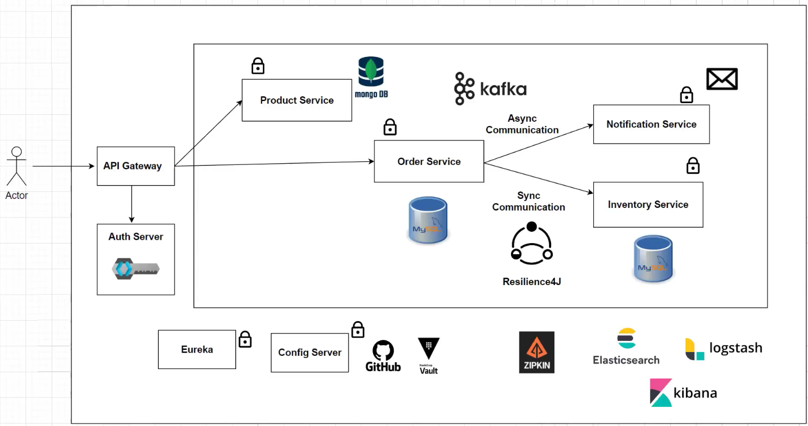

# Spring Microservice 2



This application is a simple order management system composed of several
microservices working together to provide comprehensive functionality.
The **Product Service** is responsible for managing product information,
including operations such as adding new products, and retrieving product details. 
The **Order Service** handles the process of creating and managing orders, 
including the creation of new orders. The **Inventory Service** manages 
stock inventory, performing operations such as checking stock availability. 
The Notification Service sends notifications to users or other systems in 
the form of emails, SMS, or push messages, but in this application, 
it only logs simple messages. When an order request is made, 
the Order Service calls the Inventory Service to check product availability. 
If the product is available, the order is successfully created, 
and the application sends a message to the Notification Service using Kafka.

For routing requests and aggregating data from various services, 
the **API Gateway** is used as the main entry point, handling authentication 
and authorization using Keycloak, which provides an open-source identity 
and access management solution supporting authentication and authorization 
for web applications. The Discovery Server, often implemented with Eureka 
Server, allows microservices to discover and communicate with each other 
without needing to know their physical locations.

For asynchronous communication between microservices, this project uses 
Apache Kafka, a streaming platform that builds real-time data pipelines 
and streaming applications through a publish-subscribe mechanism. 
MongoDB is chosen as the NoSQL database to store data in JSON document 
format, offering flexibility in unstructured data schemas. MySQL is used 
as the relational database management system to store structured data 
and support ACID transactions necessary for data integrity.

Docker plays a crucial role in developing, deploying, and running the 
application in containers, ensuring consistency between development and 
production environments. To monitor and analyze service performance, 
Zipkin is used as a distributed tracing system that collects execution 
time data (traces) from distributed applications and helps troubleshoot latency issues

## Table of Contents

1. [Features](#features)
2. [Requirements](#requirements)
3. [Installation](#installation)
4. [Configuration](#configuration)
5. [Endpoints](#endpoints)
6. [Contact](#contact)

## Features

- **Product Service**
   - Add new products
   - Retrieve product details

- **Order Service**
   - Create new orders

- **Inventory Service**
   - Check stock availability

- **Notification Service**
   - Send simple log notifications if order placed successfully

- **API Gateway**
   - Main entry point for all services
   - Route requests
   - Manage authentication and authorization with **Keycloak**

- **Discovery Server**
   - Enable services to discover and communicate with each other
   - Implemented with **Eureka Server**

- **Apache Kafka**
   - Asynchronous communication between services
   - Streaming platform for real-time data pipelines

- **MongoDB**
   - Store unstructured data in JSON document format

- **MySQL**
   - Store structured data

- **Docker**
   - Run the application in containers
   - Ensure consistency between development and production environments

- **Zipkin**
   - Distributed tracing system
   - Collect execution time data (traces)
   - Help troubleshoot latency issues

## Requirements
- Java 17
- Spring Boot 2.6.6
- Spring Cloud 2021.0.2
- Maven 3.9.6
- Docker (opsional)

## Installation

1. Clone repository:
    ```bash
    git clone https://github.com/anom768/springboot-microservice-2
    ```
2. Build the project using Maven:
    ```bash
    mvn clean install
    ```
3. Run Zipkin on docker:
    ```bash
    docker run -d -p 9411:9411 openzipkin/zipkin
    ```
4. Run Keycloak on docker:
    ```bash
      docker run -p 8181:8080 -e KEYCLOAK_ADMIN=admin -e KEYCLOAK_ADMIN_PASSWORD=admin quay.io/keycloak/keycloak:18.0.0 start-dev
    ```
5. Run Discovery-Server:
    ```bash
    cd discovery-server
    ```
    ```bash
    mvn spring-boot:run
    ```
6. Run Api-Gateway:
    ```bash
    cd api-gateway
    ```
    ```bash
    mvn spring-boot:run
    ```
7. Run Product-Service:
    ```bash
    cd product-service
    ```
    ```bash
    mvn spring-boot:run
    ```
8. Run order-service:
    ```bash
    cd order-service
    ```
    ```bash
    mvn spring-boot:run
    ```
9. Run inventory-service:
    ```bash
    cd inventory-service
    ```
    ```bash
    mvn spring-boot:run
    ```
10. Run notification-service:
    ```bash
    cd notification-service
    ```
    ```bash
    mvn spring-boot:run
    ```

## Configuration

Modify the configuration files as needed before running the application. For example, update the `application.properties` file:
```properties
server.port=8080
spring.datasource.url=jdbc:mysql://localhost:3306/database_name
spring.datasource.username=user
spring.datasource.password=pass
```

## Endpoints

Endpoints
1. Product-Service
    - GET http://localhost:8080/api/product - Retrieve product list
    - POST http://localhost:8080/api/product - Create new product
        - example body request
            ```json
              {
                  "name": "Iphone 13",
                  "description": "iphone 13",
                  "price": 1200
              }
          ```
2. Order-Service
    - POST http://localhost:8080/api/order - Create new order
        - example body request
            ```json
              {
                  "orderLineItemsDtoList": [
                      {
                          "skuCode": "iphone_13",
                          "price": 1200,
                          "quantity": 1
                      }
                  ]
              }
          ```
3. Inventory-Service
    - GET http://localhost:8082/api/inventory?skuCode=iphone_13_red - Get stock
4. Discovery-Server
    - Run on browser - http://localhost:8080/eureka/web
5. Zipkin
    - Run on browser - http://localhost:9411
6. Keycloak
    - Run on browser - http://localhost:8181

## Contact
- Email     : bangkitunom87@gmail.com
- Linkedin  : https://www.linkedin.com/in/bangkit-sedhayu
- Github    : https://github.com/anom768